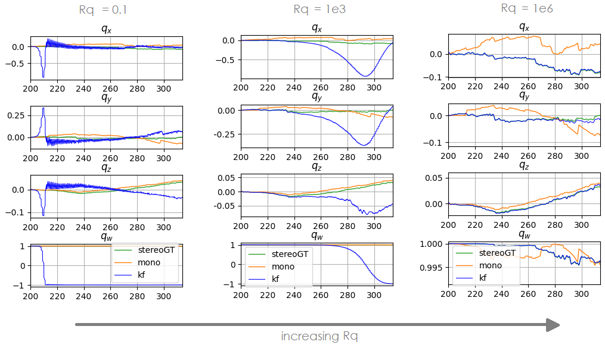
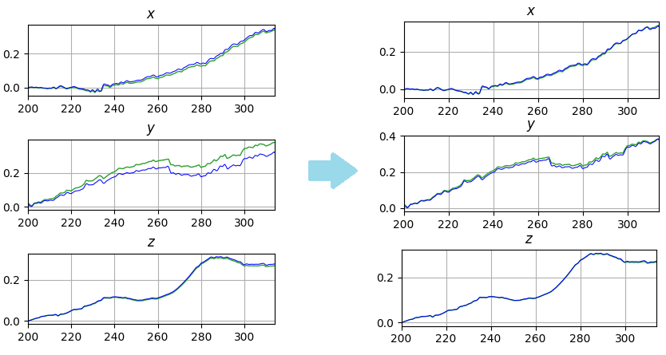

# DVI-EKF
Implementation of a loosely-coupled VI-SLAM.
Based on .

## Table of contents
* [Some notes](#some-notes)
* [Current status (of the filter)](#current-status-of-the-filter)
* [Preliminaries/Tests](#preliminariestests)
  * [Playing with noise values](#playing-with-noise-values)
  * [KF propagation only](#kf-propagation-only)
* [Old tests](/tests)
  * [Offline trajectories](/tests#offline-trajectories)
  * [Fake IMU data](/tests#fake-imu-data)
  * [Reconstructed visual trajectory](/tests#reconstructed-visual-trajectory)
  * [Comparing velocities](/tests#comparing-velocities)

-----

## Some notes
* Propagation stage works as expected,
    s. [this section](#kf-propagation-only)
* [Increasing R values](#playing-with-noise-values)
    --> less trust in camera measurements
    --> convergence towards the green (reference/stereo/IMU) trajectory.
* Possible sources of error in the update stage
    * implementation of quaternions?
    * the generation of the cov matrix P
        (s. `Filter.propagate_covariance()` [`Filter.py`](/Filter/Filter.py))
    * the update equations themselves / the corresp. code?
    * combination of the above?
* Something funny seems to happen around
    * Frame 210: where the quaternions switch to negative
    * Frame 204: quats seem to start to diverge here. also, up till
        this frame, the y position seems to be following the
        green ref. traj.
* What I've already tried: constraining the quaternions, see
    [constrain_quats](../../tree/constrain_quats) branch.


## Current status (of the filter)
```
python3 main.py all nonoise
```

Not working, something's wrong...

Pictured: KF with both propagation and update steps; **non-noisy IMU**
for the time being.
Noise values: `Q = 1e-3`, `Rp = 0.1`, `Rq = 0.05`.


Zoomed in:


## Preliminaries/Tests
### Playing with noise values
#### Increasing Rp
Increasing the measurement noise for the positions:


#### Increasing Rq
Increasing the measurement noise for the rotations:



### KF propagation only
```
python3 main.py prop nonoise
```
Using initial pose from monocular trajectory and propagating using IMU values
(**not noisy**).

Propagation equations for the states
* ignoring gravity for now, as the fake IMU data does not take
    gravity into account.
* ignoring noise here according to the method suggested in the corresp. paper.
    The noise terms are used in the covariance propagation equations.


Pictured: after correcting the fake IMU data to be in IMU coordinates. 


Increasing `num_imu_between_frames` in [`generate_data.py'](/generate_data.py)
improves the reconstruction accuracy.



