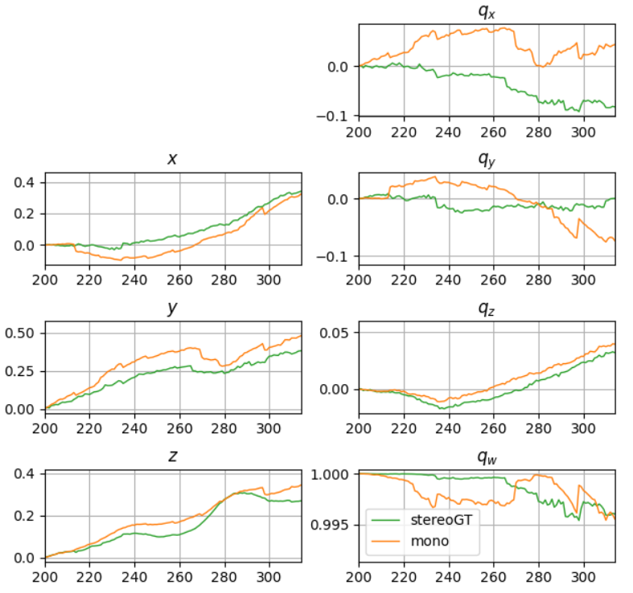
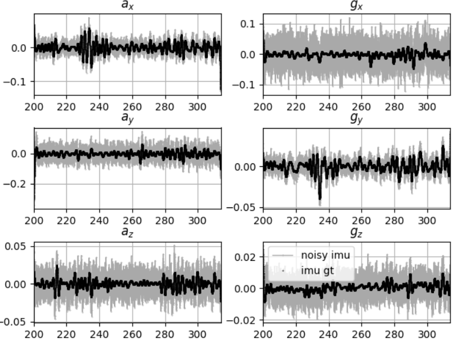

# DVI-EKF
Implementation of a loosely-coupled VI-SLAM.
Based on .

## Table of contents
* [Preliminaries/Tests](#preliminariestests)
  * [Offline trajectories](#offline-trajectories)
  * [Fake IMU data](#fake-imu-data)
  * [Reconstructed visual trajectory](#reconstructed-visual-trajectory)
  * [KF propagation only](#kf-propagation-only)
* [Current status](#current-status)

------

## Preliminaries/Tests
### Offline trajectories
```
python3 plot_traj.py
```


### Fake IMU data
```
python3 plot_imu.py
```

How they were generated:
1. Interpolation of the SLAM pose values between frames.
2. Numerical differentiation of the interpolated signals.
    * Straightforward differentiation for x, y, z --> ax, ay, az
    * Converted quaternions to Euler angles, which are then differentiated to gx, gy, gz.

To improve:
- [ ] add bias
- [ ] incorporate effects of gravity
- [ ] get rid of outliers



### Reconstructed visual trajectory
```
python3 plot_reconstructed.py
```

Aim here was to check that the generation of fake IMU data was correct.
Here I tried to reconstruct the trajectory by integrating the
generated IMU data (without noise).


### KF propagation only
Using initial pose from monocular trajectory and propagating using IMU values.


-----

## Current status
```
python3 main.py
```


Not working, something's wrong...


