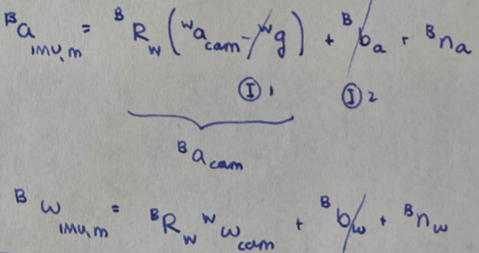
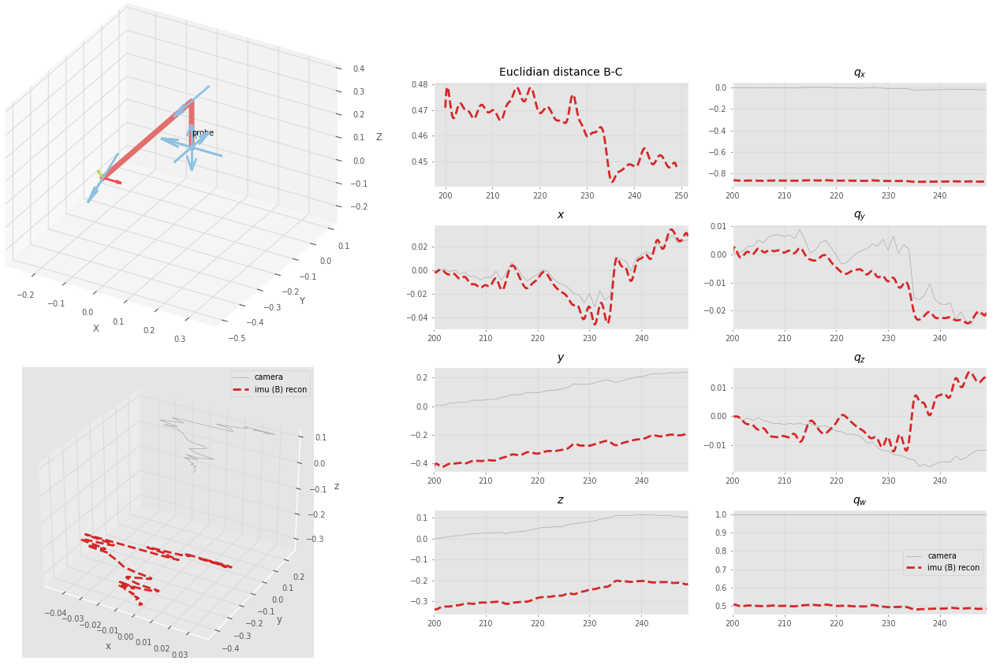
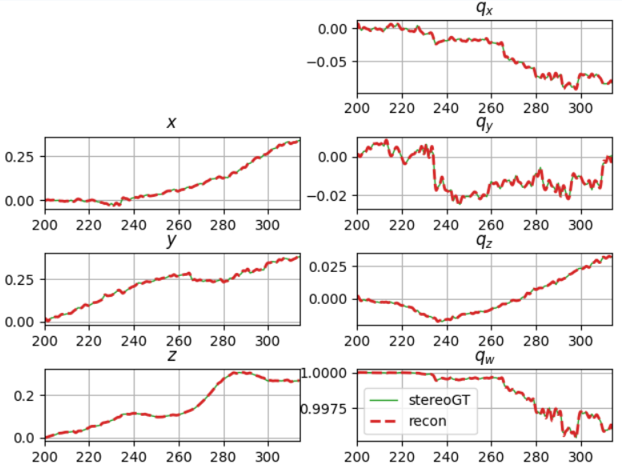
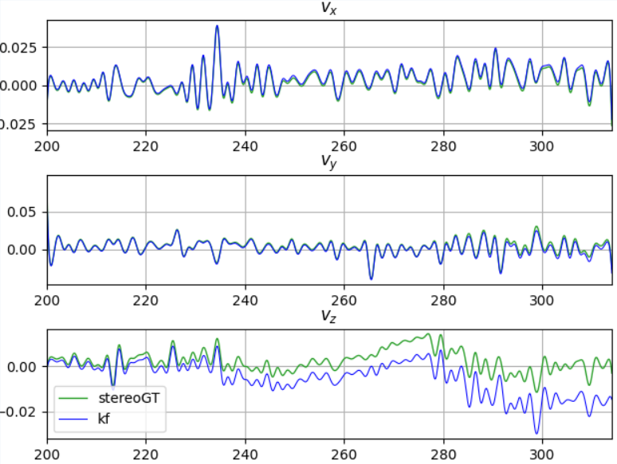

# DVI-EKF tests
The Python files here are to be run from the main (parent) folder!
Note: This repo was initially based on .

## Table of contents
* [Offline trajectories](#offline-trajectories)
* [Fake IMU data](#fake-imu-data)
* [Reconstructed visual trajectory](#reconstructed-visual-trajectory)
  * [Comparing velocities](#comparing-velocities)
* [KF propagation only](#kf-propagation-only)
* [Full KF](#full-kf)
  * [Playing with noise values](#playing-with-noise-values)
  * [Last status update](#last-status-update)

## Offline trajectories
```
python3 tests/plot_traj.py
```


## Fake IMU data
### Numerical
```
python3 tests/plot_imu.py
```

How they were generated:
1. Interpolation of the SLAM pose values between frames.
   [`VisualTraj.interpolate(num_imu_between_frames)`](https://github.com/feudalism/dvi-ekf/blob/master/Filter/Trajectory.py#L162)
2. Numerical differentiation of the interpolated signals.
   [`ImuTraj._gen_unnoisy_imu()`](https://github.com/feudalism/dvi-ekf/blob/master/Filter/Trajectory.py#L247)
    * Straightforward differentiation for x, y, z --> ax, ay, az:
        `np.gradient(interpolated.x, dt)`
    * Converted quaternions to Euler angles
         which are then differentiated to gx, gy, gz
3. Conversion of `a` and `g` to IMU coordinates.

   

To improve:
- [ ] add bias
- [ ] incorporate effects of gravity
- [ ] get rid of outliers


### Analytical
```
python3 simple_robot.py regen plot
```
  


## Reconstructed visual trajectory
```
python3 tests/plot_reconstructed.py
```

Aim here was to check whether the generation of fake IMU data was correct.
Here I tried to reconstruct the trajectory by integrating the
generated IMU data (without noise).

[`ImuTraj.reconstruct_vis_traj`](https://github.com/feudalism/dvi-ekf/blob/master/Filter/Trajectory.py#L388)
* Gets initial conditions `IC` (for the integration) from original `VisTraj`.
* Integrate:
  * `int_vals = scipy.integrate.cumtrapz(diff_vals, t, initial=0) + IC`.
  * Rotations to quaternions
* Keep in mind the coordinate transformations IMU <-> world, s. [above](#reconstructed-visual-trajectory)



### Comparing velocities
```
python3 main.py prop nonoise vel
```
Tried to compare
* velocities from the stereo trajectory (from numerical differentation of x, y, z)
* velocities from kalman filter (propagation only, IMU without noise)


Corrected the offset by setting the initial values v0 in the Kalman filter
to the initial values from the stereo trajectory.

(Previously `v0 = [0., 0., 0.]`, now `v0 = [stereoGT_traj.vx[0], stereoGT_traj.vy[0], stereoGT_traj.vz[0]]`)



## KF propagation only
```
python3 main.py prop nonoise
```
Using initial pose from monocular trajectory and propagating using IMU values
(**not noisy**).

Propagation equations for the states
* ignored gravity for now, as the fake IMU data does not take
    gravity into account.
* ignored noise here according to the method suggested in the corresp. paper.
    The noise terms are used in the covariance propagation equations.


Pictured: after correcting the fake IMU data to be in IMU coordinates. 


Increasing `num_imu_between_frames` in [`generate_data.py'](/generate_data.py)
improves the reconstruction accuracy.


## Full KF
Note: Update stage using .

### Playing with noise values
Increasing R values
* less trust in camera measurements
* convergence towards the green (reference/stereo/IMU) trajectory.

#### Increasing Rp
Increasing the measurement noise for the positions:


#### Increasing Rq
Increasing the measurement noise for the rotations:


### Last status update
```
python3 main.py all nonoise
```

Not working, something's wrong...

Pictured: KF with both propagation and update steps; **non-noisy IMU**
for the time being.
Noise values: `Q = 1e-3`, `Rp = 0.1`, `Rq = 0.05`.


Zoomed in:


 Some notes
* Possible sources of error in the update stage
    * implementation of quaternions?
    * the generation of the cov matrix P
      * (s. `Filter.propagate_covariance()` [`Filter.py`](/Filter/Filter.py))
      * overview:  
          
      * detailed definition of the matrices, s.
            [Weiss PhD thesis](http://e-collection.library.ethz.ch/eserv/eth:5889/eth-5889-02.pdf) and
            [Weiss, Siegwart 2011 paper](https://ieeexplore.ieee.org/document/5979982)
      * [my code in Python](https://github.com/feudalism/dvi-ekf/blob/44001bb6960a49e4fe6b42e7dcd5eea7ed4a9952/Filter/Filter.py#L122)
        vs [base repo's code in C++](https://github.com/skrogh/msf_ekf/blob/1bce89fa9125378b932564e0aa0eeaef3bd0ef5a/src/EstimatorBase.cpp#L192)
    * the update equations themselves / the corresp. code?
      * also see the above linked papers for the update equation definitions
      * [my code in Python](https://github.com/feudalism/dvi-ekf/blob/fe038dd593d1f6ac533197f1f6ccb19ee01ca61c/Filter/Filter.py#L155)
      vs [base repo's code in C++](https://github.com/skrogh/msf_ekf/blob/master/src/EstimatorBase.cpp#L273)
    * combination of the above?
* Something funny seems to happen around
    * Frame 210: where the quaternions switch to negative
    * Frame 204: quats seem to start to diverge here. also, up till
        this frame, the y position seems to be following the
        green ref. traj.
* What I've already tried: constraining the quaternions, see
    [constrain_quats](../../tree/constrain_quats) branch.
